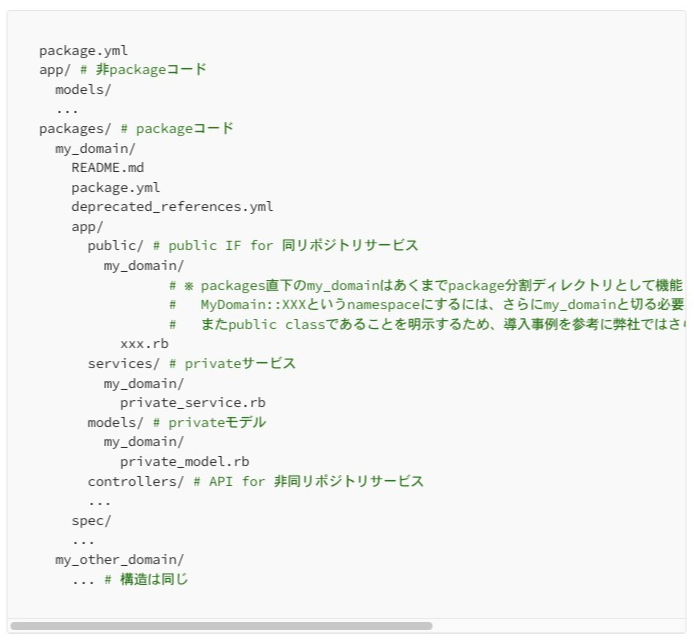

# 過剰なマイクロサービスの統廃合に取り組んでいる話

発表者: 黒木慎介
日付: 2025年9月24日

---

## アジェンダ

- 前置き
- 問題
- アプローチ
- その後

---

# 前置き

---

## 自己紹介

- フリーランス
- Railsで15年くらいアプリ作ってます
- 6年前に福岡に帰ってきてフルリモート

---

## お手伝い先

- FiNC Technologies
- 健康管理アプリ「FiNC」
- 歴史の長いマイクロサービス
- 発表について快諾いただきました🙏
- （FiNCではスリーシェイクさんとも御縁があります🙏）

---

## マイクロサービス構成の良いところ

- サービスごとに技術選択ができる
  - ほぼRailsだが、gem(依存パッケージ)の採用可否の選択などもある
- 1個のサービスに不具合があっても、その他の機能は提供しつづけられる
- デプロイまでの各ステップを軽くしやすい
  - テストの件数とか

---

# 問題

---

## 歴史の長いマイクロサービス

- 2016年頃から運用開始
  - 当時は先進技術("FiNC マイクロサービス"でググると色々)
- 技術の先取りが好きな人達が開発をドライブしてた形跡がある
  - 当時の開発者はもういない
- 2023年頃には60以上のサービスが稼働していた

---

## 細かすぎる

- 1つの仕事を1つのサービスで完結できないことが多い
- 手元の開発環境で複数のサービスを立てる手法が確立せず、動作確認ができないことが多い
- 変更時に複数のgithubレポジトリにPR提出が必要に

---

## 多すぎて把握できない

- 60以上のマイクロサービスに対して、サーバー開発人員は当初の60人から30人程度まで減少
  - 人の入れ替わりで詳細が把握されていないサービスが出てくる
  - ドキュメントがない機能なども

---

## サービスの数だけ手間がかかる

- gemの更新がマイクロサービスの数だけ必要
- 監視はサービス単位になりがち
  - サービス数はそのまま監視コストや見落としリスクに跳ね返る
- 分割したぶんだけRailsのオーバーヘッドがインフラ費用として伸し掛かる

---

# アプローチ

---

## モジュラモノリスの導入

- 複数のサービス→1つのサービスの上に複数のモジュール
- 徐々に移行
- packwerk gemを使う

---

## 徐々に移行

- 新規の機能をモジュールとして作る
- 既存の機能を作り直すときにモジュールに切り替え
  - 昨年のアプリリニューアルでのポイントからマイルへの移行など
- ドメイン境界の見直しに合わせて進めている

---

## packwerk gemの導入

- packagesディレクトリによる分離
- 依存関係を管理する

---

## packagesディレクトリ

---

## 依存関係の管理

- 依存＝別のモジュールのクラスを参照している
  - publicディレクトリ以下のものはOK
- チェック用のコマンドで検出
  - lintみたいなもの
  - 見逃す依存の設定を書くこともできる

---

# その後

---

## マイクロサービス統合の効果

- 1つのサービスで完結できる機能が増えて開発しやすくなった
- ドキュメントは急には増えないが、作り直したものについては書いている
- モジュールで分かれていると、実装を探しやすい
- サービスごとにかかる手間は削減できた

---

## 統合の進行状況

- サービスの数は50以下まで減らせている
- モジュールへの作り直しが進行しているものもあり、まだ減らせそうな見込み

---

## モジュラ「モノリス」の悪いところ

- マイクロサービスの良いところの逆
- 同じサービスに乗っているとgemやnpmモジュールに同じものを使う必要がある
- railsやgemにはグローバルな設定値がかなり多い
  - パッケージごとに挙動を変えたいケースに対応できない
- CIが重い

---

## 対策例１ npmモジュールの問題

- admin-lteという管理ツール画面用のパッケージ
- 既存機能は2系、だが新規機能は3系を使いたい
- npmのmodule alias機能で、3系に別名をつけて対応した

---

## 対策例２ CIが重い問題

- spec全件実行で15分程度かかる
- 変更があったパッケージのspecだけ実行するようにした

---

# まとめ

---

## まとめ

- マイクロサービスが古くなると大変
- モジュラモノリスに載せ替えて解決できることもあった
- 引き続き大変だけど、やっています
- 時間経過で状況が変わるので、適切なアーキテクチャを考え続ける

ご清聴ありがとうございました！ <!-- .element: class="fragment" -->

---

## 参考文献

[モジュラーモノリスへ 〜過剰なマイクロサービスの統廃合に取り組み始めた話〜](https://medium.com/finc-engineering/%E3%83%A2%E3%82%B8%E3%83%A5%E3%83%A9%E3%83%BC%E3%83%A2%E3%83%8E%E3%83%AA%E3%82%B9%E3%81%B8-%E9%81%8E%E5%89%B0%E3%81%AA%E3%83%9E%E3%82%A4%E3%82%AF%E3%83%AD%E3%82%B5%E3%83%BC%E3%83%93%E3%82%B9%E3%81%AE%E7%B5%B1%E5%BB%83%E5%90%88%E3%81%AB%E5%8F%96%E3%82%8A%E7%B5%84%E3%81%BF%E5%A7%8B%E3%82%81%E3%81%9F%E8%A9%B1-adf0efdd62ca)

今日の話の前日談です、モジュラモノリスの詳細はこちらに

---

# 質疑応答

私を捕まえて聞いて下さい！
